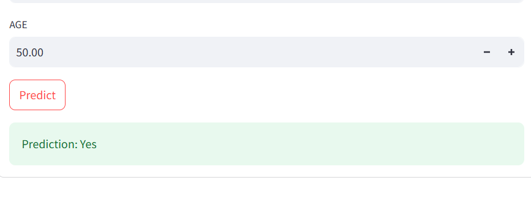

# 🏥 Aplikasi Diagnosis Medis Berbasis AI
## 📌 Gambaran Umum Proyek
Aplikasi Diagnosis Medis berbasis Kecerdasan Buatan (AI) ini dikembangkan selama Menjadi Mahasiswa Di Universitas Amikom Yogyakarta. Aplikasi ini menggunakan model Machine Learning (ML) untuk memprediksi penyakit berdasarkan data yang dimasukkan pengguna dan menampilkan visualisasi data yang informatif.

## 💾 Isi Repositori
Repositori ini berisi:
- Dataset yang sudah diproses
- Google Colab Notebook
- Model (.pkl) terlatih untuk prediksi berbagai penyakit:
  - Kanker Payudara
  - Diabetes
  - Kesehatan Janin
  - Penyakit Jantung
  - Penyakit Ginjal
  - Kanker Paru-paru
- Kode aplikasi Streamlit

## 🚀 Fitur Utama
- 🏥 Prediksi Penyakit berbasis AI menggunakan model Machine Learning
- 📊 Visualisasi Data Interaktif dengan Matplotlib & Seaborn
- 🌐 Antarmuka Web yang Ramah Pengguna menggunakan Streamlit
- 🔍 Penanganan Data yang Aman dengan Pandas

## 🖼️ Diagram Alur Aplikasi


## 🎯 Contoh Prediksi Penyakit


## 💻 Tampilan Antarmuka Pengguna


## 🛠️ Teknologi yang Digunakan
- Python 🐍 - Bahasa pemrograman utama
- Streamlit 🎨 - Framework untuk membuat aplikasi web
- Scikit-Learn 🤖 - Library untuk model machine learning
- Pandas & NumPy 📊 - Library untuk pengolahan dan analisis data

## 📌 Cara Menjalankan Aplikasi di Komputer Lokal

### Langkah 1: Mengunduh Repositori
```
git clone https://github.com/0073212/AI_Medical_Diagnosis_App.git
cd AI_Medical_Diagnosis_App
```

### Langkah 2: Membuat dan Mengaktifkan Lingkungan Virtual
```
python -m venv venv

# Untuk Windows
venv\Scripts\activate

# Untuk Mac/Linux
source venv/bin/activate
```

### Langkah 3: Memasang Semua Dependensi
```
pip install -r requirements.txt
```

### Langkah 4: Menjalankan Aplikasi
```
streamlit run app.py
```

## 🤝 Kontribusi
Silakan fork repositori ini, buat branch baru, dan ajukan pull request untuk berkontribusi pada pengembangan aplikasi! 🙌# AI-Medical-Diagnosis-App
